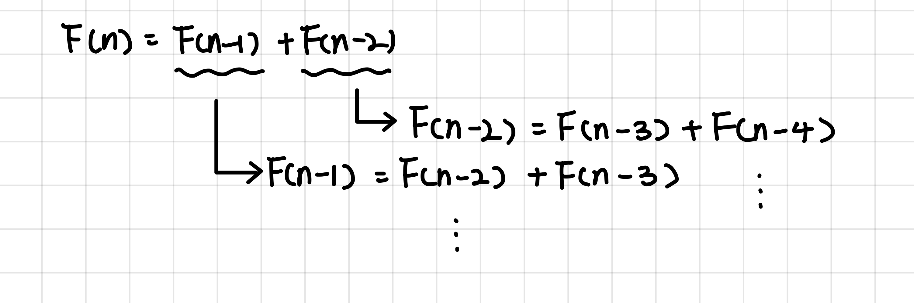
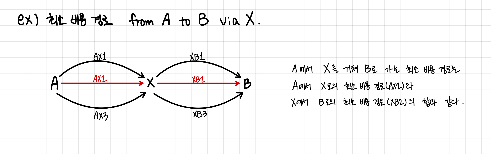

# Dynamic Programming, DP
---

## Dynamic Programming (동적계획법)
---
DP는 복잡한 문제를 작은 하위 문제로 나누어 해결하는 **알고리즘 설계 기법**이다.

>*fyi.* **알고리즘 기법과 알고리즘 설계 기법**
>
>1.알고리즘 기법
>
><u>주어진 문제를 해결하기 위한 명확한 절차나 방법론</u>을 의미한다. 
>
>구체적으로는 입력을 받아서 출력을 생성하는 명령의 유한한 순서로 구성되어 있으며, 이를 통해 문제를 해결하거나 계산을 수행한다.
>
>(ex. 정렬 알고리즘, 탐색 알고리즘, 최단 경로 알고리즘 등)
>
></br>
>
>2.알고리즘 설계 기법
>
><u>알고리즘 설계 기법은 알고리즘을 개발하고 설계하는 데 사용되는 방법론이나 전략</u>을 말한다. 
>
> 이는 효율적인 알고리즘을 설계하는 데 필요한 접근 방식을 제공하며, 다양한 유형의 문제에 적용할 수 있는 일반적인 틀이나 패턴을 포함한다. 
>
> (ex.분할 정복, 동적 프로그래밍, 그리디 알고리즘, 백트래킹 등)

따라서 정확히 말하면 다이나믹 프로그래밍은 그 자체로 알고리즘이 아닌, <u>알고리즘을 설계하는 방법론 중 하나</u>이다.

</br>

## DP의 사용 조건
---
DP가 적용되기 위해서는 아래의 2가지 조건을 만족해야 한다.

1. 하위 문제의 중복 (Overlapping Subproblems)
2. 최적 부분 구조 (Optimal Substructure)

### 1. 하위 문제의 중복 
이 조건은 주어진 문제가 하위 문제들로 나누어질 수 있어야 한다는 것을 의미한다. 다시 말해, 문제를 해결하는 과정에서 동일한 작은 문제들을 여러 번 해결해야 하는 경우가 발생해야 한다는 것이다. 이런 특성을 가진 문제들은 동적 프로그래밍을 사용함으로써, 한 번 계산한 하위 문제의 결과를 저장하고 필요할 때마다 재사용함으로써 계산 시간을 크게 단축시킬 수 있다.

> 예시 : 
> 
> 피보나치 수열 계산에서 F(n) = F(n-1) + F(n-2)를 계산하기 위해 F(n-1)과 F(n-2)가 다시 F(n-3)과 F(n-2)를 필요로 하며, 이러한 중복 계산을 **Memoization** 또는 **Tablulation**을 통해 효율적으로 처리할 수 있다.
>
> 

### 2. 최적 부분 구조
최적 부분 구조는 큰 문제의 최적 해결책이 그 문제를 구성하는 작은 문제들의 최적 해결책에서 파생될 수 있다는 성질을 말한다. 즉, 전체 문제의 최적 해가 하위 문제의 최적 해들로부터 구성될 수 있어야 한다. 이 조건이 충족되면, 작은 문제들을 해결함으로써 점차적으로 전체 문제의 최적 해를 구축해 나갈 수 있다. 

> 예시 :
>
> 최소 비용 경로 문제에서 어떤 점 A에서 점 B까지의 최소 비용 경로는 A에서 C까지의 최소 비용 경로와 C에서 B까지의 최소 비용 경로를 합친 것이다. 
>
>
</br>

## DP 사용하기
---
DP는 특정한 경우에 사용하는 알고리즘이 아니라 하나의 방법론이므로 다양한 문제 해결에 적용될 수 있다. 

그래서 DP를 적용할 수 있는 문제인지를 파악하는 것부터 코드로 구현하는 과정 까지의 난이도가 다양하다. 

일반적으로 DP를 사용하기 전에는 아래의 과정을 거쳐 진행할 수 있다.

1. DP로 해결 가능한 문제인지 확인
2. 문제의 변수 파악
3. 변수 간 관계식 설정 (점화식)
4. 메모하기(Memoization or Tabluation)
5. 기저 상태 파악
6. 구현

### 1. DP로 풀 수 있는 문제인지 확인
현재 직면한 문제가 더 작은 문제들로 구성된 하나의 함수로 표현될 수 있는지를 판단해야 한다.

즉, 위에서 언급한 <u>조건들을 충족하는 문제인지를 체크</u>해야 한다.

보통 특정 데이터 내 최대화/최소화 계산을 하거나, 특정 조건 내 데이터를 카운트해야 한다거나 확률 등의 계산의 경우 DP로 해결 할 수 있는 경우가 많다.

### 2. 문제의 변수 파악
DP는 현재 변수에 따라 그 결과 값을 찾고 그것을 전달하여 재사용하는 과정을 거친다. 즉, <u>문제 내 변수를 알아내야 한다</u>는 것이다.

이것을 영어로 <u>'state'를 결정한다</u>고 한다.

('state'에 대해서는 다음에 자세하게 알아보자.)

### 3. 변수 간 관계식 설정(점화식)
변수들에 의해 결과 값이 달라지지만 동일한 변수 값인 경우 결과는 동일하다. 또한 우리는 그 결과 값을 그대로 이용할 것이므로 그 관계식을 만들어낼 수 있어야 한다.

즉, <u>결과 값들의 관계를 함수로 표현</u>하는 것이다.

그러한 식을 **점화식**이라고 부르며, 이를 통해 우리는 짧은 코드 내에서 반복/재귀를 통해 문제가 해결되도록 구현할 수 있게 된다. 

예를 들어, 피보나치 수열에서의 점화식은 F(n) = F(n-1) + F(n-2) 이다. 

### 4. 메모하기 
변수 간 관계식 까지 성공적으로 정의했다면, <u>변수의 값에 따른 결과를 저장</u>해야 한다. 이것을 '메모'한다고 하여 **Memoization**이라고 부른다.

미리 선언된 배열에 변수 값에 따른 결과 값을 저장하고, 그 저장된 값을 재사용하는 방식으로 문제를 해결해 나간다. 

이 결과 값을 저장할 때는 주로 배열을 사용하며, 변수의 개수에 따라 배열의 차원이 결정된다.

### 5. 기저 상태 파악
이제, <u>가장 작은 문제의 상태</u>를 알아야 한다. 보통 몇 가지 예시를 직접 손으로 테스트하여 구성하는 경우가 많다. 

피보나치 수열의 경우 F(0) = 0, F(1) = 1 인 것이다. 이후 두 숫자를 더해가며 값을 구하지만 가장 작은 문제는 n=0, n=1인 경우로 볼 수 있다.

해당 문제의 기저 문제를 파악한 뒤, 배열 등에 미리 저장해두면 된다. 

### 6. 구현 
개념과 DP를 사용하는 조건, DP문제를 해결하는 과정을 모두 익혔으니 실제로 코드로 어떻게 구현하는지 알아보자. 

DP의 구현은 크게 두 가지로 구분할 수 있다. 

1. Top-Down(Memoization) 
2. Bottom-Up(Tabulation)

#### 1. Top-Down
Top-Down 접근법은 재귀적(recursion) 방식으로 문제를 해결한다. 이 방식은 큰 문제를 시작으로 더 작은 하위 문제로 나누어가면서 문제를 해결한다. 

각 하위 문제의 결과는 한 번 계산 되면 메모리에 저장되며, 같은 하위 문제가 다시 발생하면 저장된 값을 재사용한다. 

이 과정을 'Memoization'이라고 한다.

장점 :

- 문제의 자연스러운 재귀적 구조를 그대로 활용할 수 있어 개념적으로 이해하기 쉽다.
- 필요한 하위 문제만을 해결하기 때문에 불필요한 계산을 줄일 수 있다.
  
단점 :

- 재귀 호출의 스택 오버플로우 위험이 있다.
- 함수 호출에 따른 오버헤드가 있어, 때로는 비효율적일 수 있다.

```python
# Top-Down : Memoization
def fibonacci_TD(n:int) -> int:

    # 기저 상태 n=0 -> 0, n=1 -> 1
    if n == 0:
        return 0
    elif n == 1:
        return 1
    else :
        return fibonacci_TD(n-1) + fibonacci_TD(n-2)

# test case 
print(fibonacci_TD(10)) # 55
print(fibonacci_TD(5)) # 5
```

#### 2. Bottom-Up
Bottom-Up 접근법은 반복문을 사용하여 가장 작은 하위 문제부터 시작하여 점차적으로 큰 문제로 나아가면서 문제를 해결한다. 

이 방식을 'Tabulation'이라고 하며, 각 하위 문제의 결과는 테이블(주로 배열)에 저장된다.

장점 : 

- 모든 하위 문제를 체계적으로 해결하기 때문에, 계산이 빠르고 효율적일 수 있다.
- 재귀 호출의 오버헤드가 없으며, 스택 오버플로우의 위험이 없다.

단점 :

- 불필요한 하위 문제까지 해결할 수 있으며, 이는 때로 비효율적일 수 있다.
- 문제의 해결 과정을 반복문으로 직접 구현해야하므로, 코드가 복잡해질 수 있다.

```python
# Bottom-Up: Tabulation
def fibonacci_BU(n:int) -> int:
    
    # tabulation을 위한 list 정의
    dp = list()
    # 기저 상태 n=0 -> 0, n=1 -> 1
    dp.append(0)
    dp.append(1)

    for i in range(2, n+1):
        # 점화식 정의 : F(n) = F(n-1) + F(n-2)
        x = dp[i-1] + dp[i-2]
        # 결과 저장 
        dp.append(x)

    return dp[n]

# test case 
print(fibonacci_BU(10)) # 55
print(fibonacci_BU(5)) # 5
```

#### 3. Top-Down vs. Bottom-Up
Top-Down과 Bottom-Up은 모두 동적 프로그래밍의 유효한 접근 방식이다. 각 방식의 선택은 문제의 특성, 개발자의 선호도, 그리고 특정 상황에서의 효율성 등을 고려하여 결정해야 한다.

일반적으로, <u>재귀적 구조가 명확하고 특정 하위 문제만 필요한 경우에는 **Top-Down**</u>이 적합할 수 있으며, 

<u>문제를 체계적으로 접근해야 하거나 모든 가능한 경우를 고려해야 하는 경우에는 **Bottom-Up**</u>이 더 적합할 수 있다.

</br>

>*Ref.*
>
>https://hongjw1938.tistory.com/47
>
>https://velog.io/@boyeon_jeong/%EB%8F%99%EC%A0%81%EA%B3%84%ED%9A%8D%EB%B2%95Dynamic-Programming