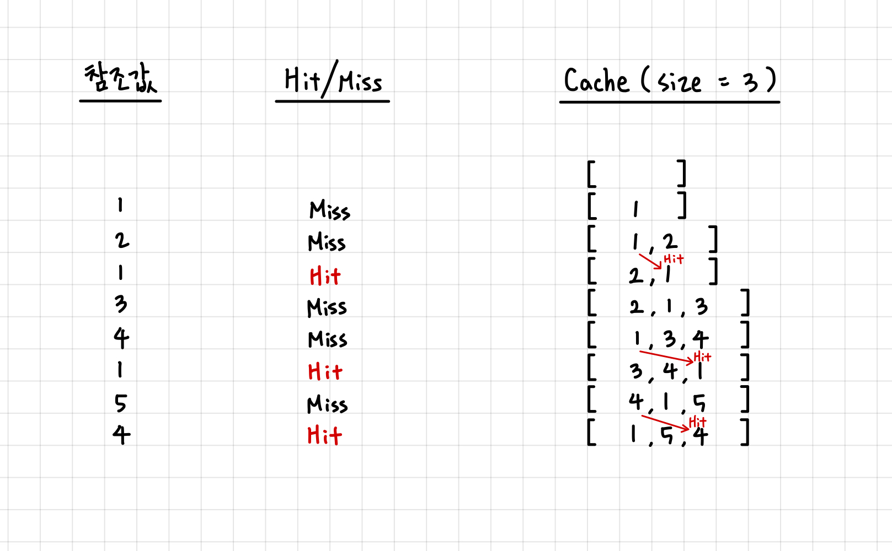

# LRU 알고리즘 (Least Recently Used Algorithm)
---


## 페이지 교체 알고리즘 
--- 
**페이지 교체 알고리즘**(page replacement algorithm)은 페이징 기법으로 메모리를 관리하는 운영체제에서, 페이지 부재가 발생하여 새로운 페이지를 할당하기 위해 현재 할당된 페이지 중 어느 것과 교체할지를 결정하는 방법이다. 

이 알고리즘이 사용되는 시기는 페이지 부재가 발생해 새로운 페이지를 적재 해야하나 페이지를 적재할 공간이 없어 이미 적재되어 있는 페이지 중 교체할 페이지를 정할 때 사용된다. 빈 페이지가 없는 상황에서 메모리에 적재된 페이지와 적재할 페이지를 교체함으로 페이지 부재 문제를 해결할 수 있다.

페이지 교체 알고리즘의 예로는, FIFO, LFU, LRU 알고리즘 등이 있다. 

오늘은 그 중 LRU 알고리즘에 대해 공부한다.

</br>

## LRU 알고리즘 
---
LRU(Least Recently Used)는 **가장 오랫동안 참조되지 않은 페이지를 교체**하는 알고리즘이다.
이는 가장 오래된 페이지는 앞으로도 사용 확률이 낮다는 가설에 의해 만들어진 알고리즘이라고 한다.

## LRU 알고리즘 원리 
--- 
LRU를 구현하기 위해서는 캐시가 가득 찼을 때, 가장 오랫동안 참조되지 않은 페이지를 찾아서 없애는 과정이 필요하다. 

페이지를 새로 참조할 때 마다 캐시 리스트에 페이지 번호를 추가(append)하면, 캐시 리스트의 0번 인덱스의 원소가 가장 오랫동안 참조되지 않은 페이지 번호가 된다.

따라서 LRU의 원리를 파이썬의 List를 사용해 생각해보면, 다음과 같이 설명할 수 있다.

캐시의 크기가 3이라면 캐시 리스트의 길이는 3이고, 캐시 리스트에 이미 3개의 페이지 번호가 들어있다면, 0번 인덱스의 페이지 번호를 지우고(pop) 새로운 페이지 번호를 추가(apppend)해주는 방식이다. 

캐시 사이즈는 3이고, 참조 값의 순서가 [1,2,1,3,4,1,5,4]인 예시를 그림으로 그려보면 다음과 같다. 



>Cache Hit & Cache Miss 
>- Cache Hit : CPU가 참조하고자 하는 메모리가 캐시에 존재하는 경우 
>- Cache Miss : CPU가 참조하고자 하는 메모리가 캐시에 존재하지 않는 경우 

</br>

## LRU 적용 문제 
프로그래머스의 [[1차] 캐시](https://school.programmers.co.kr/learn/courses/30/lessons/17680) (#17680)문제가 LRU 알고리즘을 사용하도록 되어있다. 


이 문제에 대한 내 솔루션은 다음과 같다.
city에 대해서 'Cache hit' 의 경우 cache에 존재하던 city의 index를 pop()해주고, 다시 cache에 city를 append()해 LRU알고리즘을 구현했다.
```python
# 17680
# https://school.programmers.co.kr/learn/courses/30/lessons/17680

def solution(cacheSize, cities):
    """
    [1차] 캐시 : 
    DB 캐시를 적용할 때 캐시 크기에 따른 실행시간 측정 프로그램 작성

    Args :
    - cacheSize : 0이상 30이하의 정수 
    - cities : 도시 이름으로 이루어진 문자열 배열(list), len(cities) <= 100,000
        각 도시 이름은 공백, 숫자, 특수문자 등이 없는 영문자로 구성, 대소문가 구분 x. 도시 이름은 최대 20자.

    Returns : 입력된 도시 이름 배열을 순서댇로 처리할 때, '총 실행시간' 출력 

    !! 캐시 교체 알고리즘은 LRU(Least Recently Used)를 사용
    """

    cache = []
    time = 0
    if cacheSize == 0 :
        time = 5 * len(cities)
    else :
        for city in cities:
            city = city.lower()
            if city in cache: # cache hit !! -> time += 1
                time += 1
                cache.pop(cache.index(city))
                cache.append(city)
            else : # chche miss -> tmie += 5
                time += 5
                if len(cache) == cacheSize :
                    cache.pop(0)
                    cache.append(city)
                else : 
                    cache.append(city)
    return time

# test case 
# 50
print(solution(3, ["Jeju", "Pangyo", "Seoul", "NewYork", "LA", "Jeju", "Pangyo", "Seoul", "NewYork", "LA"])) 
# 21
print(solution(3, ["Jeju", "Pangyo", "Seoul", "Jeju", "Pangyo", "Seoul", "Jeju", "Pangyo", "Seoul"])) # 21
# 60
print(solution(2,["Jeju", "Pangyo", "Seoul", "NewYork", "LA", "SanFrancisco", "Seoul", "Rome", "Paris", "Jeju", "NewYork", "Rome"])) # 60
# 52
print(solution(5, ["Jeju", "Pangyo", "Seoul", "NewYork", "LA", "SanFrancisco", "Seoul", "Rome", "Paris", "Jeju", "NewYork", "Rome"])) # 52
# 16
print(solution(2, ["Jeju", "Pangyo", "NewYork", "newyork"] )) # 16
# 25
print(solution(0, ["Jeju", "Pangyo", "Seoul", "NewYork", "LA"] )) # 25
# 27 
print(solution(3, ["A", "B", "C", "A", "D", "G", "A"] ))
# 21
print(solution(3, ['a','b','a','c','d'])) # 5 + 5 + 1 + 5 + 5 
```

</br>

>Ref.
>
>https://dailylifeofdeveloper.tistory.com/355
>
>https://ko.wikipedia.org/wiki/%ED%8E%98%EC%9D%B4%EC%A7%80_%EA%B5%90%EC%B2%B4_%EC%95%8C%EA%B3%A0%EB%A6%AC%EC%A6%98