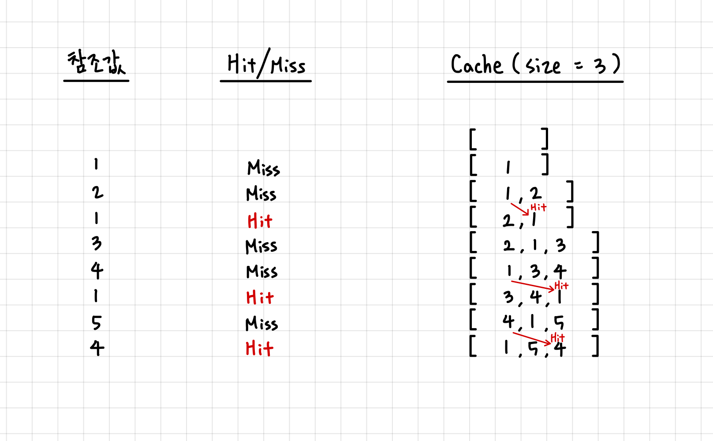

# LRU 알고리즘 (Least Recently Used Algorithm)
---
> https://dailylifeofdeveloper.tistory.com/355
> https://ko.wikipedia.org/wiki/%ED%8E%98%EC%9D%B4%EC%A7%80_%EA%B5%90%EC%B2%B4_%EC%95%8C%EA%B3%A0%EB%A6%AC%EC%A6%98
> 

## 페이지 교체 알고리즘 
--- 
**페이지 교체 알고리즘**(page replacement algorithm)은 페이징 기법으로 메모리를 관리하는 운영체제에서, 페이지 부재가 발생하여 새로운 페이지를 할당하기 위해 현재 할당된 페이지 중 어느 것과 교체할지를 결정하는 방법이다. 

이 알고리즘이 사용되는 시기는 페이지 부재가 발생해 새로운 페이지를 적재 해야하나 페이지를 적재할 공간이 없어 이미 적재되어 있는 페이지 중 교체할 페이지를 정할 때 사용된다. 빈 페이지가 없는 상황에서 메모리에 적재된 페이지와 적재할 페이지를 교체함으로 페이지 부재 문제를 해결할 수 있다.

페이지 교체 알고리즘의 예로는, FIFO, LFU, LRU 알고리즘 등이 있다. 

오늘은 그 중 LRU 알고리즘에 대해 공부한다.

 

## LRU 알고리즘 
---
LRU(Least Recently Used)는 **가장 오랫동안 참조되지 않은 페이지를 교체**하는 알고리즘이다.
이는 가장 오래된 페이지는 앞으로도 사용 확률이 낮다는 가설에 의해 만들어진 알고리즘이라고 한다.

## LRU 알고리즘 원리 
--- 
LRU를 구현하기 위해서는 캐시가 가득 찼을 때, 가장 오랫동안 참조되지 않은 페이지를 찾아서 없애는 과정이 필요하다. 

페이지를 새로 참조할 때 마다 캐시 리스트에 페이지 번호를 추가(append)하면, 캐시 리스트의 0번 인덱스의 원소가 가장 오랫동안 참조되지 않은 페이지 번호가 된다.

따라서 LRU의 원리를 파이썬의 List를 사용해 생각해보면, 다음과 같이 설명할 수 있다.

캐시의 크기가 3이라면 캐시 리스트의 길이는 3이고, 캐시 리스트에 이미 3개의 페이지 번호가 들어있다면, 0번 인덱스의 페이지 번호를 지우고(pop) 새로운 페이지 번호를 추가(apppend)해주는 방식이다. 

캐시 사이즈는 3이고, 참조 값의 순서가 [1,2,1,3,4,1,5,4]인 예시를 그림으로 그려보면 다음과 같다. 

